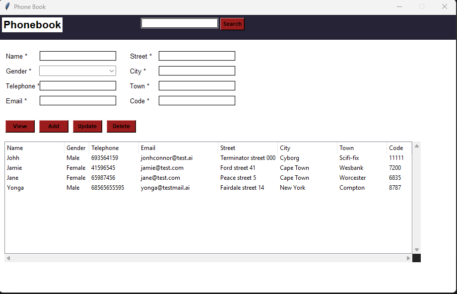
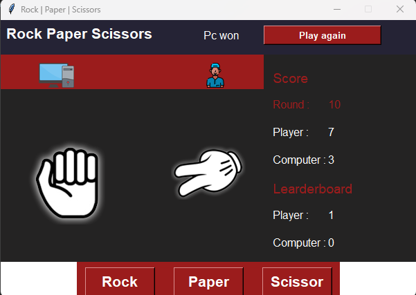

# Phonebook | Rock, Paper, Scissors | Todo List

### Frontend: Tkinter
### Backend: Python

## Key Features

- Add/Delete/Update and Search
- store data to csv file

## Key Features

- play agains computer
- Keeps track of score

- Add/Delete/Update and Search
- store data to csv file

## Key Features

- Add/Delete/Update
- store data to csv file